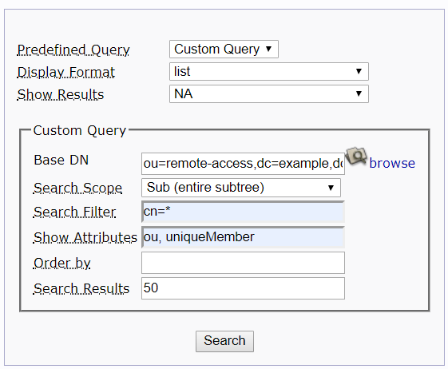

# Custom shell for Telenor project

* Made by Pierre
* Modified by Andrej

#### Useful links for us

* [Using CLion for remote development](<https://www.youtube.com/watch?v=g1zPcja3zAU>)
  * [Manual](<https://blog.jetbrains.com/clion/2018/09/initial-remote-dev-support-clion/>), [Another manual](<https://www.jetbrains.com/help/clion/remote-projects-support.html>)
  * [Cmake: -lldap](<https://stackoverflow.com/questions/34625627/how-to-link-to-the-c-math-library-with-cmake>)

* LDAP documentation
  * [Index](<https://linux.die.net/man/3/ldap>), [Extended Synchronous LDAP Search](<https://linux.die.net/man/3/ldap_search_ext_s>)

#### Shell Functionality

* What should the shell allow? what should be forbidden?
  * current codebase allows altering any linux command to do what we want

* Choices on how to execute linux commands
  * Exec [die.net](<https://linux.die.net/man/3/execvp>), [stackoverflow](<https://stackoverflow.com/questions/27541910/how-to-use-execvp>)
  * System [some site](<https://www.geeksforgeeks.org/system-call-in-c/>)

* Do we want some advanced mechanics, as command history?
  * [SO](<https://stackoverflow.com/questions/8435923/getting-arrow-keys-from-cin>)

#### Other stuff
* Some good-looking query
